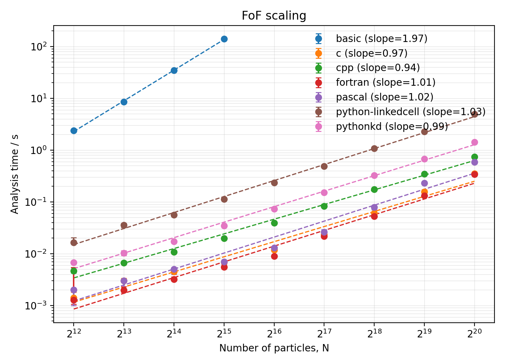

# FoF: a multi-language Friends-of-Friends benchmark

How have scientific-programming styles changed over the last forty years when
they solve exactly the same problem? This repository implements a simple
Friends-of-Friends (FoF) group finder in BBC BASIC, Pascal, Fortran, C, C++,
and Python, then measures how each version scales.



**Takeaway:** the linked-cell and k-d tree implementations scale approximately
linearly with particle count, while the naïve all-pairs BBC BASIC version scales
quadratically. Choosing the right algorithm matters far more than choosing a
"fast" language.

## Quick start

The following runs the C++ benchmark and regenerates a scaling plot. It needs a
C++17 compiler, Python 3, NumPy, and Matplotlib. SciPy is additionally needed
only for the Python cKDTree implementation.

```bash
python3 generate_nested_ics.py
mkdir -p outdir

c++ -O3 -march=native -DNDEBUG -std=c++17 \
  find_cpp_fof_groups_cascade.c -o fof_cpp
./fof_cpp

python3 plot_fof_scaling.py
```

Inputs are written to `data/`; timing tables, group catalogues, and the
regenerated plot are written to `outdir/`. Run any of the other
`find_*_fof_groups_cascade.*` programs before the last command to include its
timings in the combined plot.

Absolute runtimes depend on hardware, compiler, optimisation flags, and library
versions. The scaling trends are the intended comparison.

## What is being measured?

FoF links two particles when their periodic separation is below a linking
length. Connected links form groups. The benchmark uses synthetic particle
distributions in a periodic unit cube.

It measures nested catalogues from 2¹² (4,096) to 2²⁰ (1,048,576) particles.
The first 2¹² particles of the largest catalogue are the smallest input, the
first 2¹³ are the next input, and so on. Every implementation therefore solves
the same problem at every size.

Input-file reads and timing-table writes are excluded from the timed region;
the reported time is FoF analysis and group construction.

## Implementations at a glance

| Implementation | Neighbour search | Expected scaling |
| --- | --- | --- |
| BBC BASIC | all particle pairs | O(N²) |
| Pascal | linked cells | approximately O(N) |
| Fortran | linked cells | approximately O(N) |
| C | linked cells with a sparse cell hash | approximately O(N) |
| C++ | linked cells with a sparse cell hash | approximately O(N) |
| Python (linked-cell) | linked cells in pure Python | approximately O(N) |
| Python (cKDTree) | SciPy compiled spatial index | approximately O(N) |

The BBC BASIC version is intentionally naïve: it is a historical reference
point, not a competitive group finder. The Pascal, Fortran, C, and C++ programs
show variants of a hand-written spatial-index approach. The two Python versions
contrast interpreter overhead with using a mature compiled library through a
Python interface.

## Reproducing the comparison

1. Generate the shared catalogues with `python3 generate_nested_ics.py`.
2. Create `outdir/` and compile or run the implementations available on your
   machine. Each writes an `*_fof_timings.txt` file there.
3. Run `python3 plot_fof_scaling.py` to read every available timing table,
   compute median timings across trials, fit log-log slopes, and write:

   - `outdir/fof_scaling.png`
   - `outdir/fof_scaling_fits.txt`

The benchmark is deliberately simple; it is not a production halo finder. Its
purpose is to compare algorithmic choices, language styles, and scientific
software ecosystems.

## What the benchmark demonstrates

### Algorithms matter more than languages

The difference between O(N²) and approximately O(N) dominates the results. A
poor search strategy in a compiled language can lose to a good spatial index in
a higher-level language.

### Ecosystems matter

The SciPy cKDTree version is competitive because it delegates the expensive
spatial work to optimised compiled code. Modern scientific programming often
means assembling well-tested components rather than reimplementing every
algorithm.

### Development styles have evolved

The implementations form a small historical tour: from writing every loop and
data structure directly, through structured compiled programs, to orchestrating
high-quality libraries. The comparison is about those trade-offs, not a ranking
of languages.

## Repository guide

| File | Purpose |
| --- | --- |
| `generate_nested_ics.py` | creates the nested input catalogues |
| `find_*_fof_groups_cascade.*` | language-specific benchmark programs |
| `plot_fof_scaling.py` | combines available timing tables and plots scaling |
| `compare_group_members.py` | compares group-membership outputs |
| `fof_scaling.png` | example combined scaling plot |

## Licence

Copyright (c) 2026 Frazer Pearce. Released under the MIT Licence; see
[LICENSE](LICENSE).

## Disclaimer

This software is provided "as is", without warranty of any kind, express or
implied. It is intended for educational and benchmarking purposes.
